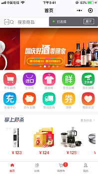
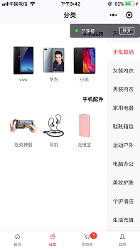
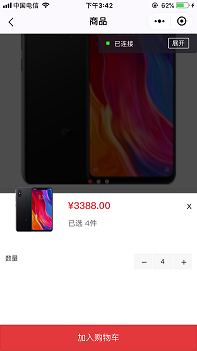
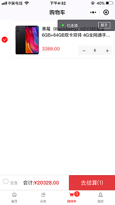
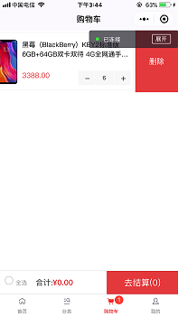
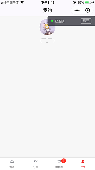

# 微信小程序-购物平台

> 根据所学知识配合微信开发文档进行项目的构建开发。

## 相关技术
	1. 微信小程序api开发文档
	
	
## 功能介绍
	- 用户授权
	- 页面结构布局
	- 数据传递
	- 数据请求
	- 商品分类
	- 商品列表
	- 商品详情
	- 商品的增减删
	- 购物车逻辑处理
	- 公用组件封装
	- 数据统一
	- 打包上传

## 项目下载
  + git上下载源码或clone到本地，
	+ git@github.com:huaKai304/wx-xcx-shopping.git
	
		
## 成果展示
 
 
 
 
  
 
