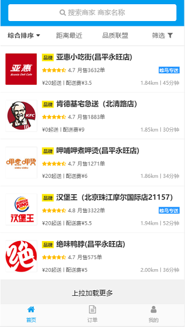
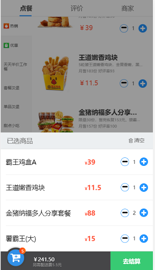

# 基于vue3.0实现仿饿了么

> 通过自己所学的vue知识，从0开始搭建的一个仿照饿了么平台的界面，实现外卖点餐除支付外的完整流程。
> 使用vue最新脚手架搭建环境，编写界面，使用axios请求接口，渲染界面,实现页面登录注册，页面的渲染。

## 相关技术
	1. vue-cli3.x：快速搭建项目开发的脚手架。
	2. vue-router：官方的路由组件，实现页面跳转，数据传值，路由拦截响应，路由守卫等。
	3. axios: 请求后端接口获取数据。
	4. mint-ui: 基于 Vue.js 的移动端组件库。快速构建出风格统一的页面，提升开发效率。
	5. 高德api: 用于精准定位和非精准定位用户所处的位置。
	6. vuex: 集中存储管理订单，用户，地址的数据状态，优化开发效率。
## 功能介绍
	- 登录注册
	- 短信验证码登录
	- 全国城市地址检索
	- 定位当前的位置
	- 上拉刷新和下拉加载
	- 商家过滤排序功能
	- 搜索商家商品名称
	- 商品菜单分类
	- 商品详情
	- 购物车
	- 商家评论
	- 订单确认
	- 生成历史订单

## 项目编译和运行
  + git上下载源码或clone到本地，
	+ git clone git@github.com:huaKai304/elm-app.git
	
  + 依赖模块安装
	+ npm/cnpm install

  + 所有依赖安装成功后在当前目录启动执行启动命令,
	+ npm run serve
		
## 成果展示
 
 
 
 
  
 
