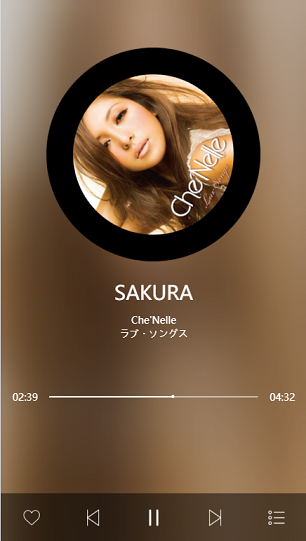
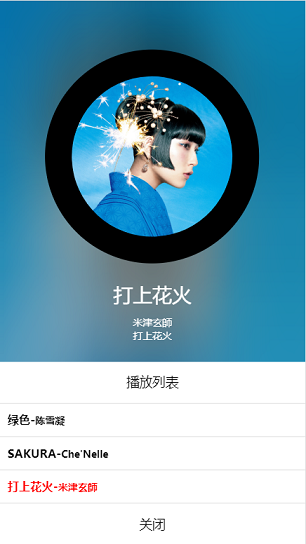

# 移动端音乐播放器

> 使用gulp构建工具并下载导入开发环境和生成环境需要的插件，例如压缩代码，解析less，开启服务器，监听自动刷新等接口插件。
> 分成封面信息、进度条和操作栏三大部分分别实现功能。

## 相关技术
	1. zepto : 轻量级移动端JavaScript库,使用与jquery库相似。
	2. gulp : gulp简单的配置参数，简单API，能快速配置好开发环境与生成环境。
	
	
## 功能介绍
	- 渲染歌手封面信息
	- 播放/暂停
	- 上/下切歌
	- 封面旋转
	- 进度条运动与拖拽

## 项目编译和运行
  + git上下载源码(推荐)或clone到本地：
	+ git clone git@github.com:huaKai304/musicDemo.git
	
  + 依赖模块安装：
	+ npm/cnpm install

  + 所有依赖安装成功后在当前目录启动执行启动命令：
	+ gulp
	
  + 执行完毕地址栏输入：
	+ http://localhost:9999/dist/html/
	
## 成果展示
 
 
 

 
 
